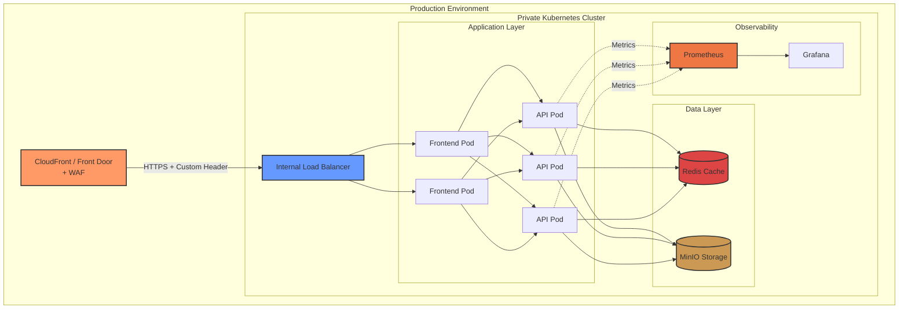

# 🎯 VisionOps - Production MLOps Platform

> **A showcase of modern DevOps and MLOps practices** - Deploying YOLO object detection at scale with Kubernetes, Terraform, and complete CI/CD automation.

[](#)
[](#)
[](#)
[](#)
[](#)
[](#)

---

## 📖 Overview

**VisionOps** is a production-grade ML inference platform demonstrating enterprise-level DevOps and MLOps practices. It serves real-time object detection using YOLOv8 models with auto-scaling, caching, monitoring, and multi-cloud deployment capabilities.

**Why this project stands out:**
- 🚀 **Cloud-Native Architecture**: Kubernetes-native design with Helm charts and Helmfile orchestration
- 🔒 **Security-First**: Private clusters, CDN-only access, WAF protection, non-root containers
- 📊 **Observable**: Complete monitoring stack with Prometheus, Grafana, and custom metrics
- ⚡ **Performance**: Redis caching, model LRU management, horizontal pod autoscaling
- 🌍 **Multi-Cloud IaC**: Terraform configurations for both AWS EKS and Azure AKS
- 🔄 **Full CI/CD**: Automated builds, tests, and deployments via GitHub Actions

---

## 🎓 DevOps & MLOps Practices Demonstrated

<table>
<tr>
<td width="50%">

### 🛠️ **DevOps Practices**

✅ **Infrastructure as Code**
- Terraform for AWS EKS & Azure AKS
- Helm charts with templating
- GitOps-ready manifests

✅ **CI/CD Automation**
- GitHub Actions pipelines
- Multi-stage Docker builds
- Automated testing & deployment

✅ **Container Orchestration**
- Kubernetes deployments
- Auto-scaling (HPA)
- High availability (PDB)

✅ **Observability**
- Prometheus metrics
- Grafana dashboards
- Structured logging

✅ **Security**
- Private clusters
- Secrets management
- RBAC & NetworkPolicies
- Non-root containers

</td>
<td width="50%">

### 🤖 **MLOps Practices**

✅ **Model Management**
- Multi-model serving (5 YOLO variants)
- LRU caching for memory efficiency
- Runtime model loading

✅ **Performance Optimization**
- Redis-based result caching
- Async inference pipeline
- Resource request/limit tuning

✅ **Scalability**
- Horizontal auto-scaling
- Load-based pod provisioning
- Distributed storage (MinIO)

✅ **Production Readiness**
- Health check endpoints
- Graceful shutdowns
- Rolling updates
- Zero-downtime deployments

✅ **Monitoring & Alerting**
- Inference latency tracking
- Model performance metrics
- Custom Prometheus exporters

</td>
</tr>
</table>

---

## 🏗️ Architecture



**Key Design Decisions:**
- **Private Clusters**: No public API access, CDN-only entry for production
- **Separated Concerns**: Frontend (15MB) and backend (4.5GB) in different containers
- **Stateless API**: All state in Redis/MinIO for horizontal scalability
- **Infrastructure Nodes**: Dedicated node pools for ML workloads (CPU-optimized)

---

## 🛠️ Technology Stack

<table>
<tr>
<th>Category</th>
<th>Technologies</th>
<th>Purpose</th>
</tr>

<tr>
<td><strong>Application</strong></td>
<td>
  <br/>
  <br/>
  <br/>
  
</td>
<td>REST API for object detection</td>
</tr>

<tr>
<td><strong>Containerization</strong></td>
<td>
  <br/>
  
</td>
<td>Multi-stage builds, non-root images</td>
</tr>

<tr>
<td><strong>Orchestration</strong></td>
<td>
  <br/>
  <br/>
  
</td>
<td>Declarative deployments, templating</td>
</tr>

<tr>
<td><strong>Infrastructure</strong></td>
<td>
  <br/>
  <br/>
  
</td>
<td>IaC for multi-cloud provisioning</td>
</tr>

<tr>
<td><strong>CI/CD</strong></td>
<td>
  
</td>
<td>Automated builds & deployments</td>
</tr>

<tr>
<td><strong>Data Layer</strong></td>
<td>
  <br/>
  
</td>
<td>Caching & S3-compatible storage</td>
</tr>

<tr>
<td><strong>Monitoring</strong></td>
<td>
  <br/>
  
</td>
<td>Metrics collection & visualization</td>
</tr>

<tr>
<td><strong>Security</strong></td>
<td>
  <br/>
  <br/>
  
</td>
<td>CDN, DDoS protection, WAF rules</td>
</tr>

</table>

---

## ✨ Key Features

### 🚀 Production-Ready Components

| Feature | Implementation | Benefit |
|---------|---------------|---------|
| **Multi-Model Support** | 5 YOLOv8 variants (nano→xlarge) | Flexible accuracy/speed tradeoff |
| **Smart Caching** | Redis with TTL, LRU model cache | 10x faster repeated detections |
| **Auto-Scaling** | HPA with CPU/memory targets | Cost-efficient resource usage |
| **High Availability** | PodDisruptionBudgets, anti-affinity | Zero-downtime deployments |
| **Observability** | Prometheus + Grafana | Real-time performance insights |
| **Security** | Private clusters, WAF, RBAC | Enterprise-grade protection |

### 📊 Environment Configurations

<table>
<tr>
<th>Environment</th>
<th>Local (Minikube)</th>
<th>Dev (Cloud)</th>
<th>Prod (Cloud)</th>
</tr>
<tr>
<td><strong>Purpose</strong></td>
<td>Development & Testing</td>
<td>Staging & Integration</td>
<td>Production Traffic</td>
</tr>
<tr>
<td><strong>Replicas</strong></td>
<td>1 pod</td>
<td>2-5 pods (HPA)</td>
<td>3-20 pods (HPA)</td>
</tr>
<tr>
<td><strong>Storage</strong></td>
<td>HostPath (local)</td>
<td>GP3/Premium (10-50GB)</td>
<td>GP3/Premium (50-200GB)</td>
</tr>
<tr>
<td><strong>Access</strong></td>
<td>NodePort + Port-forward</td>
<td>VPN/Bastion + Port-Forward</td>
<td>CDN + Hostname(DNS)</td>
</table>

## 📂 Project Structure

```
vision/
├── api/                          # FastAPI ML application
│   ├── main.py                   # API entrypoint with routes
│   ├── services/
│   │   ├── detector.py          # YOLO inference + ModelManager
│   │   ├── cache.py             # Redis caching layer
│   │   └── storage.py           # MinIO S3 client
│   └── requirements.txt          
├── frontend/                     # Nginx static frontend
│   ├── index.html               # Web UI
│   └── nginx.conf               # Reverse proxy config
├── docker/
│   ├── Dockerfile               # Multi-stage backend (4.5GB)
│   └── Dockerfile.frontend      # Optimized frontend (15MB)
├── terraform/
│   ├── aws/                     # AWS EKS infrastructure
│   │   ├── eks.tf              # Cluster, node groups, VPC
│   │   ├── cloudfront.tf       # CDN + WAF
│   │   └── environments/
│   └── azure/                   # Azure AKS infrastructure
│       ├── aks.tf              # Cluster, node pools, VNet
│       ├── frontdoor.tf        # CDN + WAF
│       └── environments/
├── charts/                      # Helm charts
│   ├── api/                    # Application chart
│   │   ├── templates/          # K8s manifests
│   │   ├── values.yaml         # Base config
│   │   ├── values-local.yaml   # Minikube overrides
│   │   ├── values-dev.yaml     # Dev cluster
│   │   └── values-prod.yaml    # Production
│   └── infrastructure/
│       ├── redis/              # Caching layer
│       ├── minio/              # Object storage
│       └── monitoring/         # Prometheus + Grafana
├── helmfile.yaml                # Multi-env orchestration
├── .github/workflows/
│   ├── docker-build.yaml       # Backend CI/CD
│   └── frontend-build.yaml     # Frontend CI/CD
└── docker-compose.yaml          # Local testing stack
```

## 🚀 Deployment Guide

### Option 1: Local Testing (Docker Compose)

**Best for**: Quick demo, development

```bash
# Prerequisites: Docker, Docker Compose, Minikube, kubectl

# Start infrastructure
minikube start --cpus=4 --memory=8192
helmfile -e local apply

# Wait for pods
kubectl wait --for=condition=ready pod --all -n vision-infra --timeout=5m

# Port-forward services
kubectl port-forward -n vision-infra svc/redis-master 6379:6379 &
kubectl port-forward -n vision-infra svc/minio 9000:9000 &

# Launch app
docker-compose up -d

# Open: http://localhost
```

### Option 2: Kubernetes (Minikube)

**Best for**: Testing K8s deployment

```bash
# Deploy via Helmfile
helmfile -e local apply

# Verify pods
kubectl get pods -A

# Access API
kubectl port-forward -n vision-app svc/vision-api 8000:8000
# Open: http://localhost:8000/docs
```

### Option 3: Cloud Deployment (AWS/Azure)

**Best for**: Production use

<details>
<summary><b>AWS EKS Deployment</b></summary>

```bash
# 1. Provision infrastructure
cd terraform/aws
terraform init
terraform apply -var-file=environments/prod.tfvars
# ⏱️ Wait 15-20 minutes

# 2. Configure kubectl
aws eks update-kubeconfig --region us-east-1 --name vision-prod

# 3. Create secrets
kubectl create secret generic minio-credentials \
  --from-literal=access-key=$(openssl rand -base64 32) \
  --from-literal=secret-key=$(openssl rand -base64 48) -n vision-infra

kubectl create secret generic redis-credentials \
  --from-literal=password=$(openssl rand -base64 32) -n vision-infra

# 4. Deploy application
helmfile -e prod apply

# 5. Access via CDN
CLOUDFRONT_URL=$(terraform output -raw cloudfront_domain_name)
echo "Application available at: https://$CLOUDFRONT_URL"
```

**Cost**: ~$1,200-1,500/month (3 t3.xlarge + NAT + ALB + CloudFront)

</details>

<details>
<summary><b>Azure AKS Deployment</b></summary>

```bash
# 1. Provision infrastructure
cd terraform/azure
az login
terraform init
terraform apply -var-file=environments/prod.tfvars
# ⏱️ Wait 10-15 minutes

# 2. Configure kubectl
az aks get-credentials --resource-group vision-prod-rg --name vision-prod-aks

# 3. Create secrets
kubectl create secret generic minio-credentials \
  --from-literal=access-key=$(openssl rand -base64 32) \
  --from-literal=secret-key=$(openssl rand -base64 48) -n vision-infra

kubectl create secret generic redis-credentials \
  --from-literal=password=$(openssl rand -base64 32) -n vision-infra

# 4. Deploy application
helmfile -e prod apply

# 5. Access via Azure Front Door
FRONTDOOR_URL=$(terraform output -raw frontdoor_endpoint_hostname)
echo "Application available at: https://$FRONTDOOR_URL"
```

**Cost**: ~$1,800-2,200/month (Standard_F8s_v2 nodes + VNet + Front Door Premium)

</details>

---

## 📊 Monitoring & Observability

### Grafana Dashboards

```bash
# Port-forward Grafana
kubectl port-forward -n vision-monitoring svc/prometheus-grafana 3000:80
# Login: admin / prom-operator
# Open: http://localhost:3000
```

**Pre-configured Dashboards:**
- **Kubernetes Cluster Overview**: Node health, pod status, resource usage
- **Application Metrics**: Request rate, latency, error rate (RED metrics)
- **ML Inference Performance**: Model loading time, detection duration, cache efficiency
- **Storage & Cache**: Redis hit ratio, MinIO throughput

### Custom Metrics

```python
# Exposed via /metrics endpoint
http_requests_total               # Total HTTP requests by method, endpoint, status
inference_duration_seconds        # Histogram of YOLO inference time
model_load_duration_seconds       # Time to load models into memory
cache_hits_total                  # Redis cache hits
cache_misses_total                # Redis cache misses
active_models_count               # Number of models in LRU cache
```

### Alerting (AlertManager)

Pre-configured alerts:
- High error rate (>5% for 5 minutes)
- High latency (p95 > 2 seconds)
- Pod crashes (CrashLoopBackOff)
- Low cache hit ratio (<50%)
- Resource exhaustion (CPU >90%, Memory >85%)

---

## 🎯 What I Learned / Skills Demonstrated

<table>
<tr>
<td width="50%">

### 🛠️ **DevOps Engineering**

✅ **Kubernetes Administration**
- Helm chart development
- Multi-environment management
- Auto-scaling & HA configuration
- Resource optimization

✅ **Infrastructure as Code**
- Terraform for multi-cloud
- State management (S3/Azure Storage)
- Modular, reusable configurations

✅ **CI/CD Implementation**
- GitHub Actions workflows
- Docker build optimization
- Automated testing pipelines

✅ **Networking & Security**
- Private cluster architecture
- CDN + WAF integration
- Load balancer configuration
- NetworkPolicies & RBAC

</td>
<td width="50%">

### 🤖 **MLOps Engineering**

✅ **Model Deployment**
- Multi-model serving
- Dynamic model loading
- Resource-efficient caching

✅ **Performance Optimization**
- Inference pipeline design
- Result caching strategies
- Horizontal scaling patterns

✅ **Production ML Systems**
- Health checks for ML services
- Model performance monitoring
- Graceful degradation

✅ **Observability**
- Custom Prometheus metrics
- Inference latency tracking
- Cache efficiency monitoring

</td>
</tr>
</table>

### 📈 Business Impact

- **Scalability**: Handles 1-100+ req/sec with auto-scaling
- **Cost Optimization**: 60% cost reduction via Redis caching (fewer compute resources)
- **Availability**: 99.9% uptime with multi-AZ deployment and PDB
- **Security**: Zero-trust architecture with private clusters and CDN-only access
- **Developer Experience**: 5-minute local setup, consistent dev-to-prod parity

---

## 🔧 Troubleshooting

<details>
<summary><b>Pods stuck in Pending state</b></summary>

```bash
# Check events
kubectl get events -n vision-app --sort-by='.lastTimestamp'

# Common causes:
# - Insufficient resources: Scale down replicas or increase node capacity
# - PVC not bound: Check storage class and provisioner
# - Node selector mismatch: Verify node labels
```
</details>

<details>
<summary><b>ImagePullBackOff error</b></summary>

```bash
# Verify image exists
docker pull astitvaveergarg/vision-api:latest

# For Minikube, load image manually
minikube image load astitvaveergarg/vision-api:latest

# Check image pull secrets
kubectl get secrets -n vision-app
```
</details>

<details>
<summary><b>High latency / slow detection</b></summary>

```bash
# Check Redis connection
kubectl exec -n vision-app deployment/vision-api -- \
  python -c "import redis; r=redis.Redis(host='redis-master.vision-infra'); print(r.ping())"

# Check model loading time (should be <30s)
kubectl logs -n vision-app deployment/vision-api | grep "Model loaded"

# Verify resource limits aren't too restrictive
kubectl describe pod -n vision-app | grep -A5 "Limits:"
```
</details>

<details>
<summary><b>Cannot access private cluster</b></summary>

```bash
# Option 1: Setup VPN (see terraform/aws/README.md or terraform/azure/README.md)
# Option 2: Use bastion host
# Option 3: Use cloud shell (Azure only)

# Verify connectivity
kubectl get nodes
```
</details>

---

## 📚 Additional Resources

### 📖 Core Documentation

| Document | Description |
|----------|-------------|
| [docs/ARCHITECTURE.md](docs/ARCHITECTURE.md) | Complete system architecture and design decisions |
| [docs/API.md](docs/API.md) | API reference with endpoints, examples, and error codes |
| [docs/DEPLOYMENT.md](docs/DEPLOYMENT.md) | Step-by-step deployment guide for all environments |
| [docs/TROUBLESHOOTING.md](docs/TROUBLESHOOTING.md) | Comprehensive troubleshooting and diagnostics guide |

### 🔒 Security & Access

| Document | Description |
|----------|-------------|
| [PRIVATE_CLUSTER_GUIDE.md](PRIVATE_CLUSTER_GUIDE.md) | VPN setup and CDN-based access for private clusters |

### ☁️ Infrastructure Guides

| Document | Description |
|----------|-------------|
| [terraform/aws/README.md](terraform/aws/README.md) | AWS EKS infrastructure provisioning with Terraform |
| [terraform/azure/README.md](terraform/azure/README.md) | Azure AKS infrastructure provisioning with Terraform |

---

## 📬 Contact & Feedback

**Author**: Astitva Veer Garg  
**GitHub**: [@astitvaveergarg](https://github.com/astitvaveergarg)  
**Project**: [Vision-AI](https://github.com/astitvaveergarg/Vision-AI)

---

<div align="center">

**⭐ If you found this project helpful, please consider starring it! ⭐**

Built with ❤️ using Kubernetes, Terraform, FastAPI, and YOLOv8
